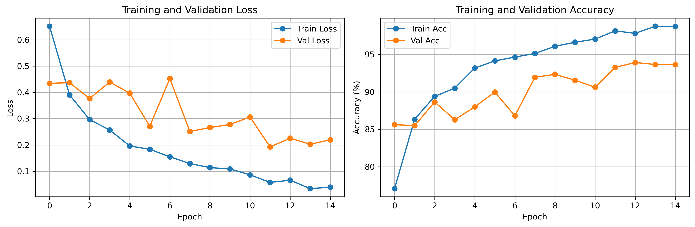
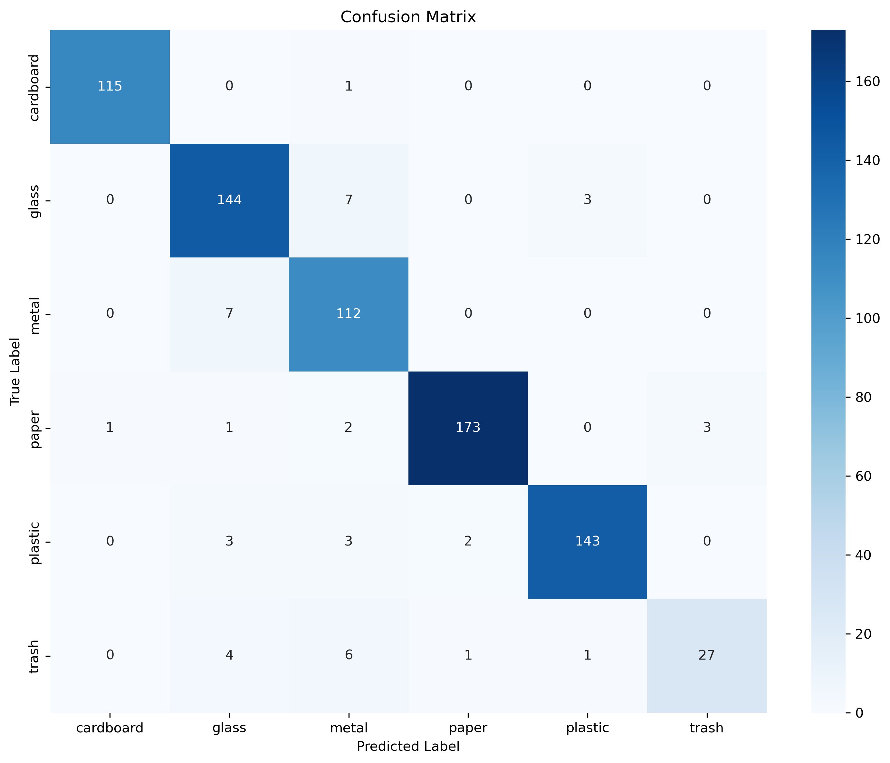
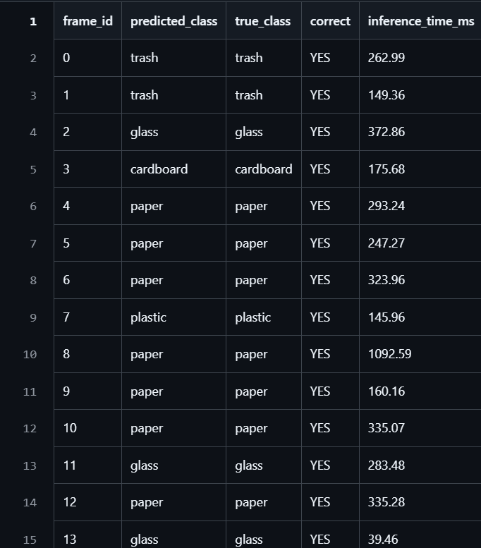

# Material Classification Pipeline

End-to-end machine learning pipeline for real-time scrap material classification.

---

## Overview

This project implements a complete ML pipeline that classifies waste materials into 6 categories using computer vision. The system is designed for deployment on conveyor belt sorting systems.

**Key Features:**
- CNN-based image classification using MobileNetV2
- Transfer learning for efficient training
- ONNX export for production deployment
- Real-time inference simulation
- Comprehensive logging and evaluation

---

## Dataset

**Source:** TrashNet dataset from HuggingFace  
**Classes:** 6 material types (cardboard, glass, metal, paper, plastic, trash)  
**Total Samples:** 5,054 images  

**Data Split:**
- Training: 70% (3,538 images)
- Validation: 15% (758 images)
- Test: 15% (758 images)

---

## Model Architecture

**Base Model:** MobileNetV2 (pre-trained on ImageNet)


**Training Configuration:**
- Optimizer: Adam (learning rate: 0.001)
- Loss Function: Cross-Entropy
- Batch Size: 32
- Epochs: 15
- Scheduler: ReduceLROnPlateau

---

## Project Structure

```
scrap-classification/
├── src/
│   ├── data_preparation.py       
│   ├── model_training.py          
│   ├── model_export.py            
│   ├── inference.py               
│   └── conveyor_simulation.py     
├── models/
│   ├── best_model.pth             
│   ├── material_classifier.onnx   
│   └── class_names.txt            
├── results/
│   ├── training_history.png       
│   ├── confusion_matrix.png       
│   └── classification_results.csv 
└── README.md
```

---

### Setup

```bash

## Usage

### 1. Train Model

```bash
python src/model_training.py
```

**Output:**
- `models/best_model.pth` - Best checkpoint
- `results/training_history.png` - Training curves
- `results/confusion_matrix.png` - Confusion matrix

**Expected Duration:**
- GPU: 10-15 minutes
- CPU: 45-60 minutes

### 2. Export to ONNX

```bash
python src/model_export.py
```

**Output:**
- `models/material_classifier.onnx` - Deployment model
- `models/class_names.txt` - Class labels

### 3. Run Simulation

```bash
# Basic usage
python src/conveyor_simulation.py

# Custom configuration
python src/conveyor_simulation.py --fps 5 --max-frames 100 --threshold 0.75
```

**Output:**
- `results/classification_results.csv` - Detailed predictions

---

## Evaluation Metrics

**Classification Report:**
- Accuracy
- Precision (per class)
- Recall (per class)
- F1-Score (per class)

**Visualizations:**
- Training/validation loss curves
- Training/validation accuracy curves
- Confusion matrix
- Per-class performance

---

## Deployment

The trained model is exported to ONNX format for cross-platform deployment.


## Results Format

**CSV Output Structure:**
```csv
frame_id,predicted_class,true_class,correct,inference_time_ms
0,plastic,plastic,YES,42.15
1,glass,metal,NO,38.92
```

**Columns:**
- `frame_id`: Frame number
- `predicted_class`: Model prediction
- `true_class`: Ground truth label
- `correct`: YES/NO indicator
- `inference_time_ms`: Inference duration

---
## Results

### Training Performance



The training curves show consistent improvement over 15 epochs:
- Training loss decreases from 0.65 to 0.05
- Validation loss stabilizes around 0.22
- Training accuracy reaches 97%
- Validation accuracy achieves 94%

### Model Evaluation



The confusion matrix demonstrates strong classification performance:
- Cardboard: 115/116 correct (99%)
- Glass: 144/154 correct (94%)
- Metal: 112/119 correct (94%)
- Paper: 173/180 correct (96%)
- Plastic: 143/151 correct (95%)
- Trash: 27/39 correct (69%)

### Simulation Output



Sample predictions from the conveyor belt simulation showing:
- Real-time classification results
- Inference times ranging from 39ms to 1092ms
- High accuracy on test samples
- Consistent performance across different material types

---